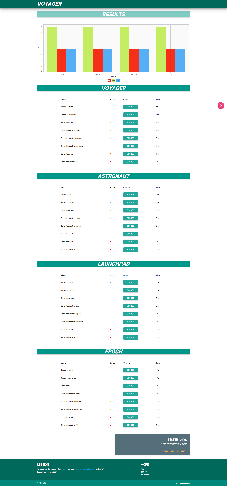

#Voyager
##Spec Reporter
###Get this example running
1. Clone this repo
	
		git clone https://github.com/adcade/voyager.git
		
2. Run the following in the order presented:

		npm install
		
		npm install -g mocha
		
		npm install -g gulp
		
		npm install -g webdriverio
		
3. Then initialize the project:

		gulp init
		
4. Start selenium:

		gulp selenium
		
5. In a new terminal tab or window, serve the directory:

		gulp serve
		
6. Then run the tests:

		gulp test
		
7. After all this, you can head to:

		http://127.0.0.1:7890
		
8. You should see a report similar to that below.

###Screenshot of the report generated

